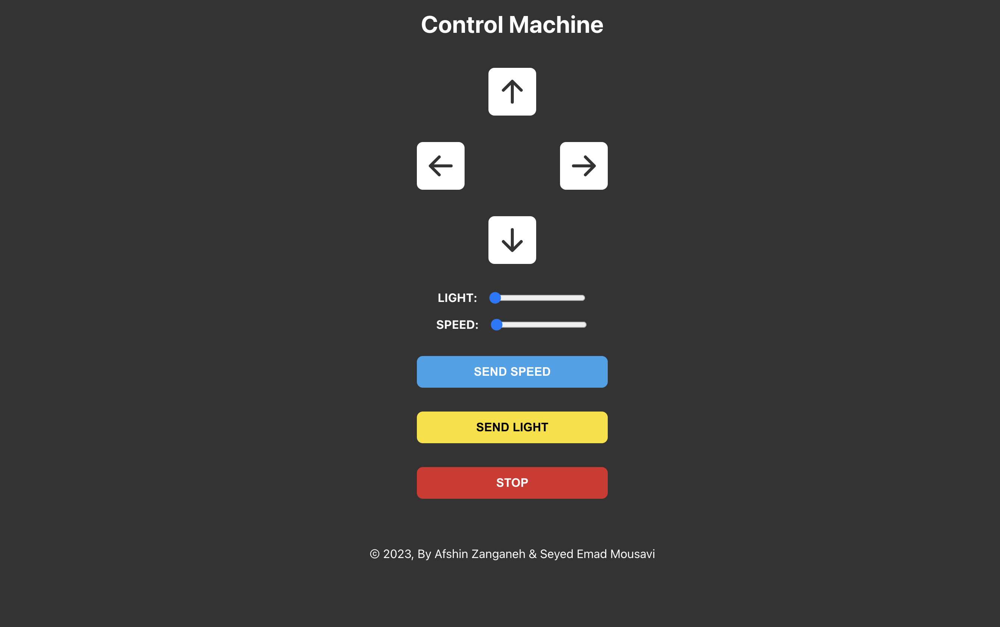
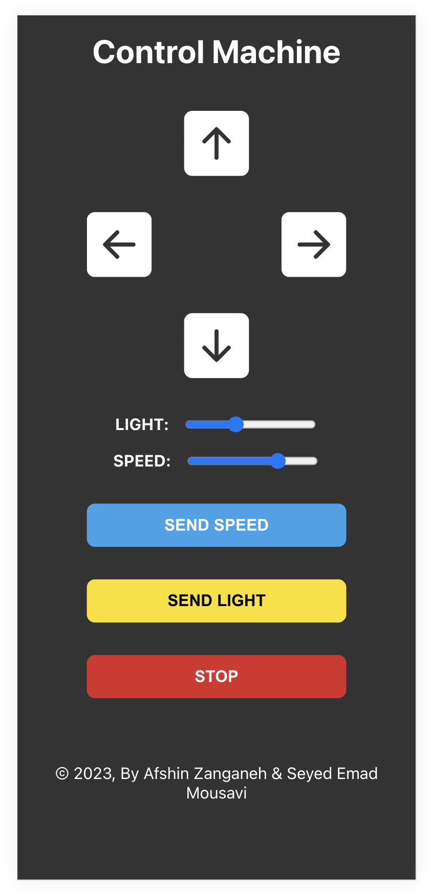

# Remotely Controlled Car Web Interface

[watch demo video](https://www.aparat.com/v/Qe7y2)

This project connects to mqtt server of the physical Car by mqtt protocol and dispath commands to drive and control the car. It is the Embedded Real-Time Systems and IoT course project.

Desktop Website:

Mobile Website:
 

## Available Scripts

In the project directory, you can run:

### `yarn start`

Runs the app in the development mode.
Open [http://localhost:3000](http://localhost:3000) to view it in your browser.

The page will reload when you make changes.
You may also see any lint errors in the console.

### `yarn build`

Builds the app for production to the `build` folder.
It correctly bundles React in production mode and optimizes the build for the best performance.
